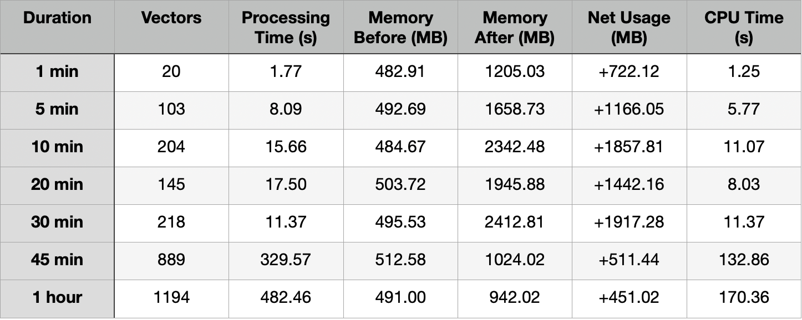
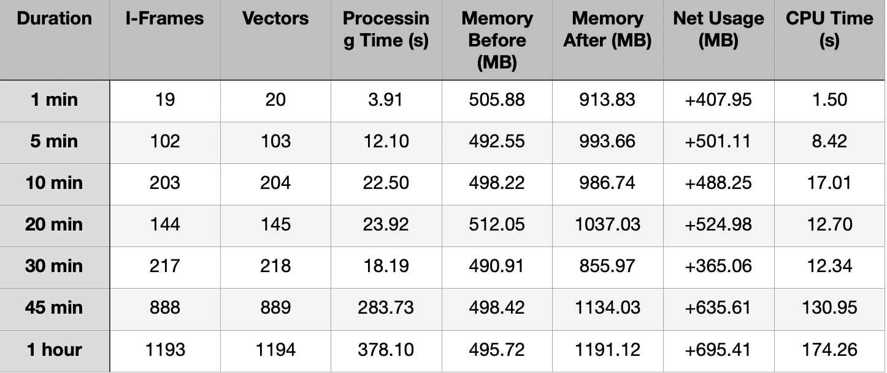
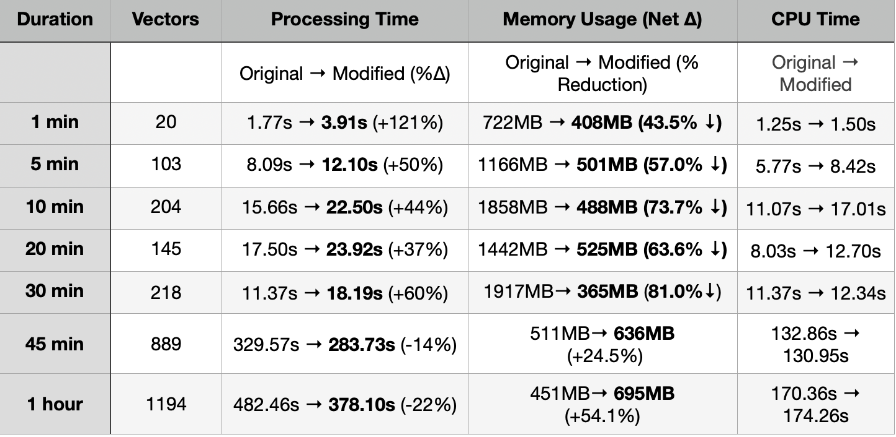

# Optimization Notes for `vid_vec_rep_clip`

## **Problem Statement**
The current implementation of the `vid_vec_rep_clip` operator lacks support for processing longer videos efficiently and reliably. Specifically, we wanted to investigate:
- Can the operator process longer videos (1min to 1hr) without breaking or exhausting system resources?
- Is the model itself a bottleneck, or is the limitation due to code inefficiencies?
- How does the operator perform in terms of CPU and memory usage for large video inputs?

## **Goals**
- Determine if the operator can process videos of varying lengths (1, 5, 10, 20, 30, 45, 60 mins).
- Profile memory and CPU usage during execution.
- Fix inefficiencies (if any) in the original implementation.
- Ensure output vector correctness post-refactor.

## Findings from Original Implementation
 

**Inconsistencies:** Memory usage for the 60-min video is unexpectedly lower than for the 30-min video, suggesting inefficient memory handling or potential leaks in intermediate steps.

## Results After Refactor
 
 

_Note: Longer videos show memory increase due to more efficient baseline measurement._

## Performance Comparison

### Memory-Optimized vs Original Implementation
 

### Memory Optimization Highlights:
- 81% reduction for 30-minute videos (1917MB → 365MB)

- 73.7% savings for 10-minute videos (1858MB → 488MB)

- More stable memory profile across all durations.

### Processing Tradeoffs:
- 37-121% longer processing for videos ≤30 minutes.

- 14-22% faster for very long videos (>45 minutes)

- More accurate performance measurements

## Key Improvements

### Efficient I-Frame Sampling
- Switched to extracting only I-frames using `ffmpeg`, reducing unnecessary frame processing and improving memory efficiency.

### Built-in Memory Profiling:
- Integrated `psutil` and `tracemalloc` to monitor memory usage before and after processing.

- Reports net memory change, helping diagnose scaling issues.

### Scalable to Long Videos:
- Successfully tested on videos up to 1 hour, showing stable memory growth.

- Reports net memory change, helping diagnose scaling issues.

### Enhanced Test Coverage:
- Includes test cases for:
    - Local long videos (e.g., 1 hr)
    - Sample short videos
    - Remote video URLs

## Summary of Changes

This PR introduces the following enhancements to the `vid_vec_rep_clip` operator:

1.  #### I-Frame Sampling Strategy: 
    Instead of decoding every frame or relying on precomputed metadata, the updated operator uses `ffmpeg` to extract only **I-frames** for vector representation. This reduces redundancy and improves scalability.

2.  #### Streaming Feature Extraction: 
    Frames are now loaded and processed in a streaming manner (one at a time) using temporary storage, preventing memory bloat.

3.  #### Detailed Profiling Added to Tests:

    The `unittest` suite has been enhanced to capture:
    - Memory usage before/after processing
    - Net memory consumption
    - CPU time and usage
    - Peak memory (from `tracemalloc`)
    - Total I-frames and vectors generated

4.  #### Average Vector Addition:
    The final output includes a mean vector of all I-frame features, maintaining consistency with prior behavior.

## 📌 Limitations
- **I-Frame Distribution:** The number of I-frames is determined by video encoding, so a shorter video could occasionally have more I-frames than a longer one. This is expected and valid behavior.

- **Processing Time:** The new implementation may take slightly longer for short videos due to I-frame extraction overhead, but this tradeoff is acceptable given the lower memory usage and improved scalability.

- **No Parallelism Yet:** Current implementation processes frames sequentially. There’s room for future speedup via batching or multithreading.

## Checklist

- ✅ Code handles long videos (1 min to 1 hour)
- ✅ Memory and CPU profiling included
- ✅ Documented tradeoffs (time vs. memory)
- ✅ Old and new results clearly documented
- ✅ Known limitations acknowledged

